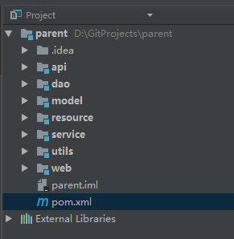
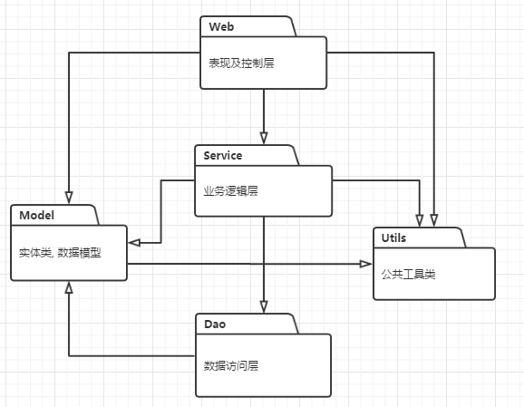
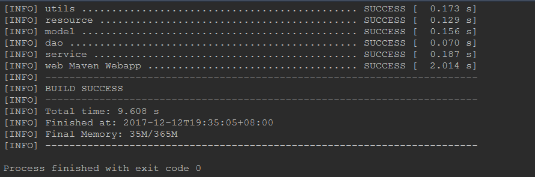

文章来源
https://www.cnblogs.com/owenma/p/8029518.html


# parent
Springboot项目maven多模块拆分项目代码


##多模块拆分的必要性
	使用Java技术开发的工程项目，无论是数据处理系统还是Web网站，随着项目的不断发展，需求的不断细化与添加，工程项目中的代码越来越多，包结构也越来越复杂这时候工程的进展就会遇到各种问题： 
	
	（1）不同方面的代码之间相互耦合，这时候一系统出现问题很难定位到问题的出现原因，即使定位到问题也很难修正问题，可能在修正问题的时候引入更多的问题。 
	
	（2）多方面的代码集中在一个整体结构中，新入的开发者很难对整体项目有直观的感受，增加了新手介入开发的成本，需要有一个熟悉整个项目的开发者维护整个项目的结构（通常在项目较大且开发时间较长时这是很难做到的）。 
	
	（3）开发者对自己或者他人负责的代码边界很模糊，这是复杂项目中最容易遇到的，导致的结果就是开发者很容易修改了他人负责的代码且代码负责人还不知道，责任追踪很麻烦。 
	
	将一个复杂项目拆分成多个模块是解决上述问题的一个重要方法，多模块的划分可以降低代码之间的耦合性（从类级别的耦合提升到jar包级别的耦合），每个模块都可以是自解释的（通过模块名或者模块文档），
	
	模块还规范了代码边界的划分，开发者很容易通过模块确定自己所负责的内容。

### 多模块项目结构例子：


### 依赖关系：


dao层依赖model 
service依赖dao、mode、utils 
web层依赖service、dao、model、utils

### 打包发布jar文件
springboot项目总要是在多模块化拆分之后还能打成可执行的jar包。

1. 在启动类中修改pom文件(也就是web项目的)
```
    <build>
            <!-- 为jar包取名 -->
            <finalName>owen-start</finalName>
            <plugins>
                <plugin>
                    <groupId>org.springframework.boot</groupId>
                    <artifactId>spring-boot-maven-plugin</artifactId>
                    <version>1.3.0.RELEASE</version>
                </plugin>
            </plugins>
        </build>
```
2. 在parent中的pom中添加

```
<build>
        <plugins>
            <plugin>
                <!-- The plugin rewrites your manifest -->
                <groupId>org.springframework.boot</groupId>
                <artifactId>spring-boot-maven-plugin</artifactId>
                <version>1.3.0.RELEASE</version>
                <configuration><!-- 指定该Main Class为全局的唯一入口 -->
                    <mainClass>com.owen.OwenApplication</mainClass>
                    <layout>ZIP</layout>
                </configuration>
                <executions>
                    <execution>
                        <goals>
                            <goal>repackage</goal><!--可以把依赖的包都打包到生成的Jar包中-->
                        </goals>
                        <!--可以生成不含依赖包的不可执行Jar包-->
                        <!-- configuration>
                          <classifier>exec</classifier>
                        </configuration> -->
                    </execution>
                </executions>
            </plugin>
        </plugins>
    </build>
```
3. 执行打包命令，mvn package -Dmaven.test.skip=true 跳过测试。

    
4. 生成可执行的jar。

